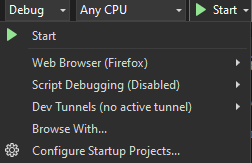
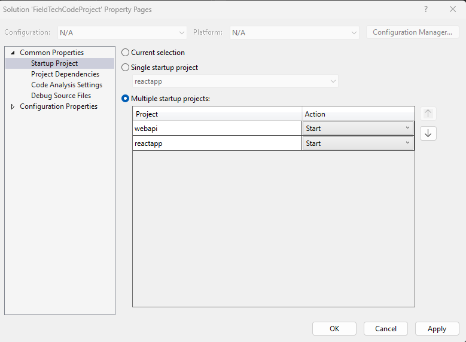

# Fieldtech Code Project

## Setup/Run Instructions
1. Clone or download this repo
2. Open the solution file using Visual Studio
3. Check that the startup configuration launches both the react and webapi projects
   - Access Configuration through the 'Configure Startup Projects...' option in the Start button dropdown.
    > 
   - Ensure that multiple startup projects is selected and their actions are set to start like the image below.
    > 
4. On startup, two browsers should open. One with the react frontend and the other with SwaggerUI.